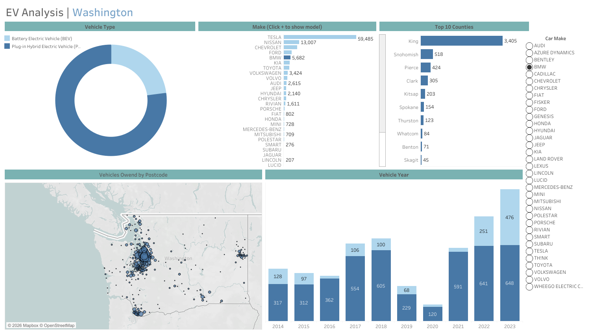

# ⚡ Washington Electric Vehicle Dashboard Analysis

🔗 **Interactive Tableau Dashboard:**  
https://public.tableau.com/shared/M75YRSP6W?:display_count=n&:origin=viz_share_link

---

# 📷 Dashboard Preview

## Washington EV Dashboard Overview

[](https://public.tableau.com/shared/M75YRSP6W?:display_count=n&:origin=viz_share_link)

---

# 📌 Deskripsi Project
Project ini merupakan dashboard analisis kendaraan listrik (*Electric Vehicle Analysis*) menggunakan Tableau dengan dataset kendaraan listrik di negara bagian Washington, Amerika Serikat.

Dashboard dirancang untuk membantu menganalisis distribusi kendaraan listrik berdasarkan:
- lokasi,
- jenis kendaraan,
- manufacturer,
- model kendaraan,
- electric range,
- serta eligibility kendaraan terhadap program Clean Alternative Fuel Vehicle (CAFV).

Visualisasi dashboard dibuat secara interaktif menggunakan:
- Column Chart
- Donut Chart
- Bar Chart
- Map Visualization
- Parameter Filters

Project ini bertujuan untuk membantu stakeholder memahami perkembangan adopsi kendaraan listrik dan pola distribusinya berdasarkan wilayah maupun karakteristik kendaraan.

---

# 🎯 Tujuan Project
- Menganalisis distribusi kendaraan listrik di Washington.
- Mengidentifikasi manufacturer dan model EV yang paling dominan.
- Memahami persebaran EV berdasarkan county dan city.
- Menganalisis electric range kendaraan.
- Mengevaluasi CAFV eligibility kendaraan listrik.
- Menyediakan dashboard interaktif untuk eksplorasi data kendaraan listrik.

---

# 🗂️ Dataset Information

Dataset terdiri dari beberapa kolom utama:

| Kolom | Deskripsi |
|---|---|
| VIN (1-10) | Identifikasi kendaraan |
| County | Wilayah county kendaraan |
| City | Kota kendaraan |
| State | Negara bagian |
| Postal Code | Kode pos |
| Model Year | Tahun model kendaraan |
| Make | Manufacturer kendaraan |
| Model | Model kendaraan |
| Electric Vehicle Type | Jenis kendaraan listrik |
| CAFV Eligibility | Status eligibility clean fuel vehicle |
| Electric Range | Jarak tempuh listrik |
| Base MSRP | Harga dasar kendaraan |
| Legislative District | Distrik legislatif |
| DOL Vehicle ID | ID kendaraan |
| Vehicle Location | Lokasi kendaraan |
| Electric Utility | Utility provider |
| 2020 Census Tract | Census tract area |

---

# 🛠️ Tools & Technologies
- Tableau
- Data Visualization
- Interactive Dashboard
- Parameter Filter
- Geospatial Visualization

---

# 📊 Dashboard Features

## ✅ KPI & Interactive Dashboard
Dashboard menampilkan visualisasi interaktif untuk:
- Distribusi kendaraan listrik
- Manufacturer EV terpopuler
- Distribusi model kendaraan
- Persebaran geografis kendaraan listrik
- Electric range analysis
- CAFV eligibility analysis

---

## ✅ Parameter Filters
Dashboard menyediakan filter interaktif sehingga pengguna dapat:
- memfilter berdasarkan manufacturer,
- model year,
- city,
- maupun jenis kendaraan listrik.

Hal ini memudahkan eksplorasi data secara dinamis.

---

# 📈 Visualisasi yang Digunakan

| Visual | Fungsi |
|---|---|
| Column Chart | Analisis jumlah kendaraan berdasarkan kategori |
| Donut Chart | Distribusi jenis kendaraan listrik |
| Bar Chart | Perbandingan manufacturer dan model EV |
| Map Visualization | Persebaran kendaraan listrik berdasarkan wilayah |
| Interactive Filter | Eksplorasi data secara dinamis |

---

# 📌 Business Insight & Data Analyst Analysis

## 1. Pertumbuhan Adopsi Kendaraan Listrik
Data menunjukkan tingginya jumlah kendaraan listrik yang terdaftar di Washington.

### Insight Data Analyst:
- Adopsi EV terus meningkat seiring perkembangan teknologi kendaraan ramah lingkungan.
- Washington menunjukkan kesiapan infrastruktur dan demand terhadap kendaraan listrik.

### Business Impact:
- Peluang pasar EV semakin besar.
- Industri charging station dan energi terbarukan memiliki potensi pertumbuhan tinggi.

---

## 2. Manufacturer EV Mendominasi Market
Bar chart menunjukkan beberapa manufacturer mendominasi pasar kendaraan listrik.

### Insight Data Analyst:
- Brand tertentu memiliki market share jauh lebih besar dibanding kompetitor.
- Dominasi manufacturer menunjukkan tingkat kepercayaan konsumen terhadap brand EV tertentu.

### Rekomendasi:
- Kompetitor dapat menganalisis strategi pricing dan teknologi brand dominan.
- Perusahaan dapat fokus pada segmentasi market EV premium maupun affordable EV.

---

## 3. Distribusi Geografis Kendaraan Listrik
Map visualization menunjukkan persebaran kendaraan listrik tidak merata di seluruh wilayah Washington.

### Insight Data Analyst:
- Area urban memiliki jumlah EV lebih tinggi dibanding area rural.
- Infrastruktur charging station kemungkinan lebih berkembang di kota besar.

### Rekomendasi:
- Pemerintah dan perusahaan energi dapat memperluas infrastruktur EV di wilayah dengan penetrasi rendah.
- Strategi ekspansi dapat difokuskan pada wilayah dengan pertumbuhan EV tinggi.

---

## 4. Analisis Electric Range
Sebagian kendaraan memiliki electric range yang jauh lebih tinggi dibanding model lainnya.

### Insight Data Analyst:
- Konsumen cenderung memilih kendaraan dengan electric range lebih tinggi.
- Electric range menjadi salah satu faktor penting dalam keputusan pembelian EV.

### Business Insight:
- Manufacturer dengan teknologi battery efficiency lebih baik memiliki competitive advantage.
- Inovasi battery technology menjadi faktor utama persaingan industri EV.

---

## 5. CAFV Eligibility Analysis
Analisis CAFV eligibility menunjukkan sebagian besar kendaraan memenuhi persyaratan clean alternative fuel vehicle.

### Insight Data Analyst:
- Kebijakan pemerintah memiliki pengaruh terhadap peningkatan adopsi kendaraan listrik.
- Incentive program dapat meningkatkan penggunaan EV secara signifikan.

### Rekomendasi:
- Pemerintah dapat memperluas incentive program untuk meningkatkan penggunaan kendaraan ramah lingkungan.
- Manufacturer dapat menyesuaikan spesifikasi kendaraan agar memenuhi eligibility program.

---

## 6. Analisis Tahun Model Kendaraan
Distribusi model year menunjukkan peningkatan kendaraan listrik pada tahun-tahun terbaru.

### Insight Data Analyst:
- Industri EV berkembang sangat cepat dalam beberapa tahun terakhir.
- Konsumen semakin tertarik menggunakan kendaraan listrik modern.

### Business Value:
- Pertumbuhan pasar EV menciptakan peluang investasi jangka panjang.
- Market trend menunjukkan transisi menuju kendaraan ramah lingkungan.

---

# 📌 Kesimpulan
Dashboard ini membantu proses analisis kendaraan listrik secara interaktif melalui visualisasi data yang informatif dan mudah dipahami.

Melalui dashboard ini, stakeholder dapat:
- memahami tren adopsi kendaraan listrik,
- menganalisis distribusi EV berdasarkan wilayah,
- mengidentifikasi manufacturer dominan,
- mengevaluasi electric range kendaraan,
- serta mendukung pengambilan keputusan berbasis data.

Project ini juga menunjukkan kemampuan dalam:
- data visualization,
- dashboard development,
- geospatial analysis,
- interactive filtering,
- dan business insight generation menggunakan Tableau.

---

# 📂 Struktur Project

```bash
Washington-EV-Dashboard/
│
├── Dashboard/
│   ├── Washington_EV_Dashboard.png
│
├── Dataset/
│   ├── Electric_Vehicle_Population_Data.xlsx
│
├── Tableau/
│   ├── Washington_Ev_Dashboard.twb
│
├── README.md
